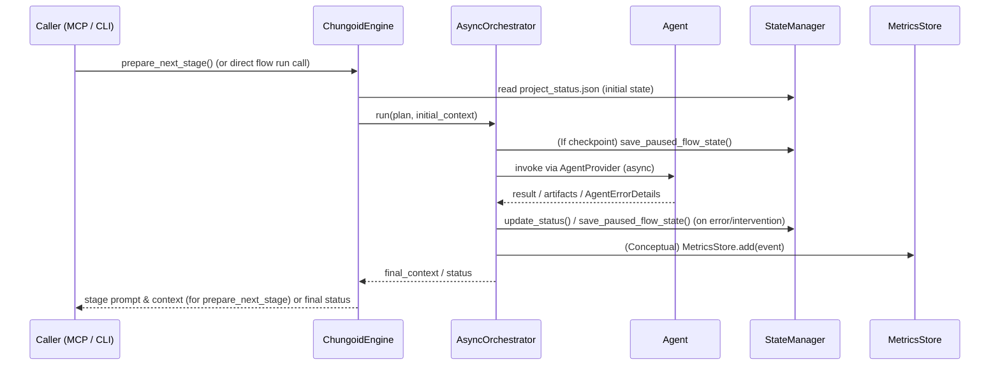

<!-- 
This file was automatically synchronized from dev/docs/core_architecture_overview.md
Last sync: 2025-05-23T18:46:08.924283
Transform: adapt
Description: Update core architecture documentation with current system design
-->

# Chungoid Core – System Architecture Overview

> **Status:** Stable – last updated 2025-05-10.
>
> This document explains *how the Chungoid core works* – from high-level
> concepts down to module boundaries – for three target audiences:
>
> 1. **Engineers** who need to modify or extend the runtime.
> 2. **Power-users / integrators** embedding Chungoid in their own stack.
> 3. **Investors & decision-makers** evaluating the technical moat.
>
> Use the Table of Contents ☰ in your Markdown viewer to jump to any
> section.

---

## 1. TL;DR (The 30-second pitch)
Chungoid Core turns **natural-language stage prompts** + **YAML flow files**
into deterministic execution against a registry of agents/tools – while
capturing reflections, metrics and vector-searchable knowledge along the
way.  Think *Next-gen GitHub Actions* but purpose-built for AI-agent
collaboration.

```mermaid
flowchart LR
    subgraph User Input
        A1(Stage prompts\n+ Flow YAML)
    end
    A1 -->|load| B1[ChungoidEngine]
    B1 --> C1(PromptManager)
    B1 --> D1(StateManager)
    B1 --> E1(Runtime \nAsyncOrchestrator)
    E1 -->|invoke| F1[[Agent / Tool]]
    D1 -->|persist| G1[(ChromaDB)]
    D1 --> H_file[(project_status.json)]
    E1 -->|metrics (conceptual)| H1[(MetricsStore)]
```

---

## 2. Package Map
| Package | Path | Purpose |
|---------|------|---------|
| **`chungoid.engine`** | `src/chungoid/engine.py` | Facade exposing MCP tools and coordinating sub-systems. |
| **`chungoid.utils.*`** | `src/chungoid/utils/` | Shared infrastructure: state, prompts, enhanced agent registration (`AgentCard` with categories/capabilities, schema defined in `AgentCard.json`) and resolution (`AgentProvider` with category-based selection), metrics, logging. |
| **`chungoid.runtime`** | `src/chungoid/runtime/` | Thin orchestrator (`AsyncOrchestrator`) that walks an `ExecutionPlan` and calls agents, supporting both direct ID and category-based agent resolution. |
| **`chungoid.flow_executor`** | `src/chungoid/flow_executor.py` | Helper that loads a flow YAML and runs it through the orchestrator. |
| **`server_prompts/`** | `chungoid-core/server_prompts/` | Prompt templates for each stage (0 – N). |
| **`schemas/`** | `src/chungoid/schemas/` | JSON-Schema for Stage-Flow DSL (supporting `agent_category` in `MasterStageSpec`), enriched `AgentCard` (via `AgentCard.json`, with categories, capabilities, priority), agent registry, etc. |

---

## 3. Execution Lifecycle (Happy-path)


On error the `AsyncOrchestrator` consults the stage's `on_error` policy, which may lead to a pause (state saved via `StateManager`), a branch to an error-handling stage, or flow termination. Human intervention via CLI (e.g., `chungoid resume-flow`) interacts with `StateManager` and triggers `AsyncOrchestrator.resume_flow()`.

The step `Orchestrator->>Agent: invoke via AgentProvider (async)` involves the `Orchestrator` resolving the target agent via the `AgentProvider`. This resolution may be a direct lookup by `agent_id` or a dynamic selection based on `agent_category` and `agent_selection_preferences` as defined in the `MasterStageSpec` of the `ExecutionPlan`. The `AgentProvider` then returns an invokable agent.

---

## 4. Data Stores & File Layout
| Store | Tech | Path | What lives there? |
|-------|------|------|-------------------|
| **Vector DB** | Chroma (persistent) | `./dev_chroma_db/` | Reflections, embedded docs, metrics, agent registry (enriched `AgentCard`s, schema in `AgentCard.json`, with categories, capability profiles, priorities). |
| **Status File** | JSON | `<project>/.chungoid/project_status.json` | Stage progress, artifacts, run history. |
| **Prompt Templates** | YAML (Jinja2) | `server_prompts/stages/` | Reusable prompt skeletons per stage. |
| **Stage Artifacts** | Arbitrary files | User project tree | Generated code / docs per stage. |

---

## 5. Extensibility Points
1. **Agents/Tools** – Register new `AgentCard`s via `AgentRegistry.add()`, including their categories, capability profiles, and priority to enable category-based discovery and selection.
2. **Stage Prompts** – Add or edit YAML under `server_prompts/stages/`.
3. **Runtime Hooks** – Sub-class `AsyncOrchestrator` (or `SyncOrchestrator` for simpler cases) or add
   `Plugin` classes (roadmap) for cross-cutting behaviours.
4. **Metrics Export** – Implement an OTLP exporter in
   `utils/metrics_store.py` (placeholder stub exists).
5. **Ability to pause/resume/retry flows** – Primarily managed by `AsyncOrchestrator` and `StateManager`.

---

## 6. Developer Quick-start
```bash
# 1. Activate venv & install core in editable mode
pip install -e chungoid-core/.[test]

# 2. Run a sample flow
python -m chungoid.flow_executor dev/examples/sample_flow.yaml

# 3. Tail metrics
python - <<'PY'
from chungoid.utils.metrics_store import MetricsStore
for evt in MetricsStore().query(limit=5):
    print(evt)
PY
```

---

## 7. Competitive Advantages (Investor Lens)
* **Agent-native orchestration** – Built for AI workflows, not retro-fitted.
* **Self-documenting** – Prompts, flows, and reflections are all stored in
  vector-searchable form, enabling automatic reasoning and audit trails.
* **Modular & Embeddable** – Core runtime has <1 000 LOC and zero heavy
  external dependencies beyond Chroma.
* **Meta-layer coupling** – Powerful meta-engineering environment ensures
  rapid iteration while keeping documentation and tests in lock-step.

---

## 8. Future Roadmap (Core-side)
| Milestone | Description | ETA |
|-----------|-------------|-----|
| **Async Runtime** | Non-blocking orchestrator for IO-heavy agents. | Q3-2025 |
| **Plugin System** | First-class hooks for retry / circuit-breaker / metrics. | Q3-2025 |
| **Live Debugger** | Web UI to step through a running flow. | Q4-2025 |

---

## 9. Glossary (Core-specific)
| Term | Definition |
|------|------------|
| **Stage** | A discrete prompt-driven unit of work within a flow. |
| **ExecutionPlan** | In-memory representation of the Flow YAML graph. |
| **Reflection** | Structured, persisted agent thought used for RAG + audit. |
| **AgentResolver** | Utility that maps `agent_id` → callable tool, or resolves an agent by `agent_category` and `agent_selection_preferences` by querying the `AgentRegistry` (which stores `AgentCard` data, structured according to `AgentCard.json`). Optionally falls back to MCP HTTP. |
| **MetricEvent** | Pydantic model capturing duration, status, and metadata of a stage run. |

---

*This is a living document.*
*Last updated: 2025-05-15 by Gemini Assistant*

*© Chungoid Labs 2025 – non-restricted shareable excerpt* 