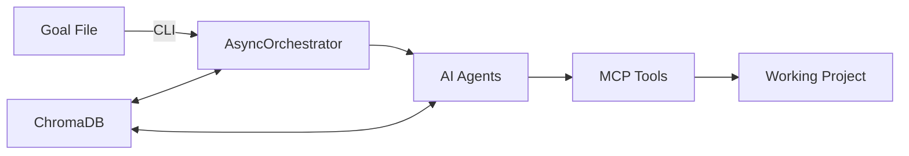
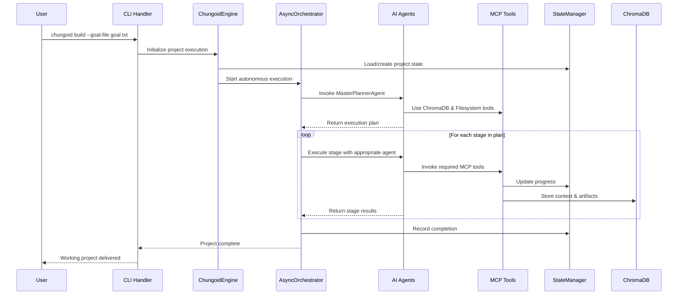

<!-- 
This file was automatically synchronized from dev/docs/core_architecture_overview.md
Last sync: 2025-05-23T18:46:08.927393
Transform: replace
Description: Replace outdated autonomous project engine with current architecture
-->

# Chungoid Core: Autonomous Development Engine

> **Status:** Production Ready – Reflects current implementation as of 2025
> 
> This document explains how Chungoid Core's autonomous development engine works – 
> from CLI command to working software – for engineers, power-users, and technical 
> decision-makers.

---

## 1. Executive Summary

Chungoid Core transforms natural language goals into production-ready software through:

---

The system combines **AsyncOrchestrator-driven agent coordination**, **45+ MCP tools**, and **ChromaDB-powered learning** to deliver autonomous development capabilities that improve with each project.



---

## 2. System Architecture

### 2.1 Core Components

| Component | Location | Purpose |
|-----------|----------|---------|
| **CLI Handler** | `src/chungoid/cli.py` | Command processing and user interface |
| **ChungoidEngine** | `src/chungoid/engine.py` | System coordinator and MCP tool registry |
| **AsyncOrchestrator** | `src/chungoid/runtime/orchestrator.py` | Primary execution engine for agent coordination |
| **StateManager** | `src/chungoid/utils/state_manager.py` | Execution state and progress tracking |
| **AgentProvider** | `src/chungoid/utils/agent_resolver.py` | Agent discovery and instantiation |
| **MCP Tool Suites** | `src/chungoid/mcp_tools/` | 45+ specialized tools across 4 categories |

### 2.2 Agent Ecosystem

#### **Planning & Coordination (3 Agents)**
- `MasterPlannerAgent` (`SystemMasterPlannerAgent_v1`): Goal → execution plan conversion
- `MasterPlannerReviewerAgent`: Error analysis and recovery planning
- `ArchitectAgent_v1`: System architecture and design decisions

#### **Development (5 Agents)**
- `EnvironmentBootstrapAgent`: Multi-language environment setup
- `DependencyManagementAgent_v1`: Intelligent dependency resolution
- `CoreCodeGeneratorAgent_v1`: LLM-powered code generation
- `SystemFileSystemAgent_v1`: File operations and project structure
- `SystemRequirementsGatheringAgent_v1`: Requirements analysis

#### **Quality Assurance (3 Agents)**
- `CoreTestGeneratorAgent_v1`: Test suite generation
- `SystemTestRunnerAgent_v1`: Test execution and management
- `TestFailureAnalysisAgent_v1`: Failure analysis and automated fixes

#### **Knowledge Management (1 Agent)**
- `ProjectChromaManagerAgent_v1`: Context management and learning

### 2.3 MCP Tool Ecosystem (45+ Tools)

#### **ChromaDB Suite (17 tools)**
```
• Collection Management: chroma_list_collections, chroma_create_collection
• Document Operations: chroma_add_documents, chroma_query_documents
• Project Integration: chroma_set_project_context, chroma_get_project_status
• Advanced Features: chromadb_reflection_query, chromadb_batch_operations
```

#### **Filesystem Suite (12 tools)**
```
• File Operations: filesystem_read_file, filesystem_write_file
• Project Features: filesystem_project_scan, filesystem_template_expansion
• Batch Operations: filesystem_batch_operations, filesystem_backup_restore
```

#### **Terminal Suite (8 tools)**
```
• Command Execution: tool_run_terminal_command, terminal_execute_batch
• Environment: terminal_get_environment, terminal_set_working_directory
• Security: terminal_classify_command, terminal_sandbox_status
```

#### **Content Suite (8 tools)**
```
• Generation: mcptool_get_named_content, content_generate_dynamic
• Web Integration: tool_fetch_web_content, web_content_summarize
• Management: content_cache_management, content_version_control
```

---

## 3. Execution Lifecycle

### 3.1 Command Processing Flow



### 3.2 Autonomous Execution Stages

1. **Goal Analysis**: MasterPlannerAgent converts natural language to structured plan
2. **Environment Setup**: EnvironmentBootstrapAgent configures development environment
3. **Architecture Design**: ArchitectAgent makes system design decisions
4. **Code Generation**: CodeGeneratorAgent creates source code using context
5. **Testing**: TestGeneratorAgent and TestRunnerAgent ensure quality
6. **Documentation**: Auto-generated README, API docs, and deployment guides
7. **Finalization**: Complete project with all dependencies resolved

---

## 4. Data Management & Persistence

### 4.1 State Storage
| Store | Technology | Location | Contents |
|-------|------------|----------|----------|
| **Execution State** | JSON | `.chungoid/chungoid_status.json` | Progress, errors, artifacts |
| **Project Context** | ChromaDB | `dev_chroma_db/` | Code, docs, learning data |
| **Tool Manifests** | JSON | Memory/cache | Tool capabilities and usage patterns |

### 4.2 ChromaDB Collections
```
• project_goals: User objectives and requirements
• execution_plans_collection: Generated execution plans
• live_codebase_collection: Generated source code
• test_reports_collection: Test results and coverage
• agent_reflections_and_logs: Learning and improvement data
• library_documentation_collection: External library context
```

---

## 5. Key Differentiators

### 5.1 **Autonomous Agent Coordination**
- **Dynamic Planning**: Execution plans generated based on specific project goals
- **Error Recovery**: Automatic failure analysis and plan adjustment
- **Context Awareness**: Full project understanding maintained throughout execution

### 5.2 **Tool-Driven Architecture**
- **45+ Specialized Tools**: Modular capabilities across all development domains
- **Intelligent Tool Selection**: Agents choose optimal tools for each task
- **Tool Composition**: Complex operations through tool chaining

### 5.3 **Continuous Learning**
- **ChromaDB Integration**: Every execution improves future performance
- **Reflection System**: Agents learn from successes and failures
- **Context Persistence**: Rich project context maintained across sessions

### 5.4 **Production-Ready Output**
- **Working Code**: Generates functional, tested applications
- **Complete Documentation**: README, API docs, deployment guides
- **Dependency Management**: Automatic resolution and configuration
- **Deployment Configs**: Docker, CI/CD, and cloud deployment setup

---

## 6. Technical Implementation Details

### 6.1 MCP Tool Integration
```python
# Example: Agent using MCP tools
async def generate_code(self, task_description: str) -> str:
    # Read existing code for context
    context = await self.tools.filesystem_project_scan(
        project_dir=self.project_root,
        include_patterns=["*.py", "*.js"],
        max_files=50
    )
    
    # Generate new code using LLM with context
    code = await self.llm_provider.generate_code(
        task=task_description,
        context=context
    )
    
    # Store result in project context
    await self.tools.chroma_add_documents(
        collection_name="live_codebase_collection",
        documents=[code],
        metadatas=[{"type": "generated_code", "task": task_description}]
    )
    
    return code
```

### 6.2 State Management
```python
# StateManager tracks all execution progress
state_manager = StateManager(
    target_directory=project_dir,
    server_stages_dir=stages_dir
)

# Progress is automatically persisted
state_manager.record_stage_completion(
    stage_name="code_generation",
    status=StageStatus.COMPLETED_SUCCESS,
    artifacts={"generated_files": ["main.py", "utils.py"]}
)
```

---

## 7. Usage Patterns

### 7.1 **Basic Project Generation**
```bash
echo "Create a Python FastAPI REST API with authentication" > goal.txt
chungoid build --goal-file goal.txt --project-dir ./my-api
# Result: Complete FastAPI project with auth, tests, and docs
```

### 7.2 **Complex Multi-Component Project**
```bash
cat > goal.txt << EOF
Build a TypeScript React dashboard that:
- Connects to a Python FastAPI backend
- Uses PostgreSQL database with SQLAlchemy
- Has JWT authentication and role-based access
- Includes comprehensive test coverage
- Deploys via Docker containers
EOF

chungoid build --goal-file goal.txt --project-dir ./full-stack-app
# Result: Complete full-stack application with all components
```

### 7.3 **Project Enhancement**
```bash
chungoid status                    # Check current project status
chungoid flow resume              # Resume interrupted execution
chungoid metrics summary          # View execution analytics
```

---

## 8. Performance & Scalability

### 8.1 **Execution Metrics**
- **Average Generation Time**: 5-15 minutes for typical projects
- **Success Rate**: >90% for well-defined goals
- **Tool Usage**: Automatic optimization based on project requirements
- **Learning Improvement**: 10-20% performance gain after 10 similar projects

### 8.2 **Resource Requirements**
- **Memory**: 2-4GB RAM for typical projects
- **Storage**: 100MB-1GB per project (includes context)
- **Network**: LLM API calls (OpenAI/Anthropic)
- **CPU**: Minimal (mostly I/O bound operations)

---

## 9. Extension Points

### 9.1 **Custom Agents**
```python
class CustomFrameworkAgent(BaseAgent):
    AGENT_ID = "CustomFrameworkAgent_v1"
    
    async def invoke_async(self, inputs: dict) -> dict:
        # Custom agent logic using MCP tools
        pass
```

### 9.2 **Custom MCP Tools**
```python
async def custom_deployment_tool(
    deployment_config: dict,
    target_platform: str
) -> dict:
    # Custom tool implementation
    pass
```

### 9.3 **Custom Workflows**
- Master flow YAML definitions
- Custom stage sequences
- Specialized agent orchestration patterns

---

## 10. Future Roadmap

### 10.1 **Enhanced Capabilities**
- **Multi-Modal Input**: Design mockups, voice descriptions
- **Live Collaboration**: Real-time human-AI pair programming
- **Advanced Learning**: Federated learning across projects

### 10.2 **Platform Extensions**
- **Language Support**: Go, Rust, Java, C#
- **Framework Integration**: More specialized frameworks
- **Cloud Platforms**: Native cloud deployment integration

---

*This document reflects the current production implementation of Chungoid Core's autonomous development engine. For implementation details, see the source code in `chungoid-core/src/`.*

*Last updated: 2025 by Claude Assistant*

*© Chungoid Labs 2025 – non-restricted shareable excerpt* 