# Autonomous System Architecture Diagram

This document provides a comprehensive visual overview of Chungoid's current autonomous development system, showing the actual agents, MCP tools, and workflows as implemented in the codebase.

```mermaid
graph TD
    %% Style Definitions
    classDef userInput fill:#e1f5fe,stroke:#0277bd,stroke-width:2px,color:#000;
    classDef cliCommand fill:#f3e5f5,stroke:#7b1fa2,stroke-width:2px,color:#000;
    classDef coreInfra fill:#fff3e0,stroke:#f57c00,stroke-width:2px,color:#000;
    classDef orchestrator fill:#e8f5e8,stroke:#388e3c,stroke-width:3px,color:#000;
    classDef agent fill:#e3f2fd,stroke:#1976d2,stroke-width:2px,color:#000;
    classDef mcpTools fill:#fce4ec,stroke:#c2185b,stroke-width:2px,color:#000;
    classDef datastore fill:#f1f8e9,stroke:#689f38,stroke-width:2px,color:#000;
    classDef output fill:#fff8e1,stroke:#ffa000,stroke-width:2px,color:#000;

    %% User Input
    UserGoal["User Goal File\n(goal.txt)"]:::userInput
    CLICommand["chungoid build\n--goal-file goal.txt\n--project-dir ."]:::cliCommand
    
    %% Core Infrastructure
    subgraph CoreInfra ["Chungoid Core Infrastructure"]
        CLI["CLI Handler\n(cli.py)"]:::coreInfra
        Engine["ChungoidEngine\n(engine.py)"]:::coreInfra
        StateManager["StateManager\n(.chungoid/chungoid_status.json)"]:::coreInfra
        AgentProvider["AgentProvider\n(agent_resolver.py)"]:::coreInfra
        PromptManager["PromptManager"]:::coreInfra
        LLMProvider["LLMProvider"]:::coreInfra
    end

    %% Central Orchestrator
    AsyncOrch["AsyncOrchestrator\n(Primary Execution Engine)"]:::orchestrator

    %% ChromaDB Context & Learning
    ChromaDB["ChromaDB Instance\n(Project Context & Learning)"]:::datastore

    %% Planning & Coordination Agents
    subgraph PlanningAgents ["Planning & Coordination Agents"]
        MasterPlanner["MasterPlannerAgent\n(SystemMasterPlannerAgent_v1)"]:::agent
        PlannerReviewer["MasterPlannerReviewerAgent\n(Error Analysis & Recovery)"]:::agent
        ArchitectAgent["ArchitectAgent_v1\n(System Design Decisions)"]:::agent
    end

    %% Development Agents
    subgraph DevAgents ["Development Agents"]
        EnvBootstrap["EnvironmentBootstrapAgent\n(Multi-language Setup)"]:::agent
        DepMgmt["DependencyManagementAgent_v1\n(Intelligent Dependencies)"]:::agent
        CodeGen["CodeGeneratorAgent\n(CoreCodeGeneratorAgent_v1)"]:::agent
        SystemFS["SystemFileSystemAgent_v1\n(File Operations)"]:::agent
        RequirementsAgent["SystemRequirementsGatheringAgent_v1\n(Requirements Analysis)"]:::agent
    end

    %% Quality Assurance Agents
    subgraph QAAgents ["Quality Assurance Agents"]
        TestGen["TestGeneratorAgent\n(CoreTestGeneratorAgent_v1)"]:::agent
        TestRunner["SystemTestRunnerAgent_v1\n(Test Execution)"]:::agent
        TestFailAnalysis["TestFailureAnalysisAgent_v1\n(Failure Analysis & Fixes)"]:::agent
    end

    %% Knowledge Management
    subgraph KnowledgeAgents ["Knowledge Management"]
        ChromaManager["ProjectChromaManagerAgent_v1\n(Context & Learning)"]:::agent
    end

    %% MCP Tool Suites (45+ Tools)
    subgraph MCPTools ["MCP Tool Ecosystem (45+ Tools)"]
        ChromaTools["ChromaDB Suite (17 tools)\n• chroma_list_collections\n• chroma_create_collection\n• chroma_add_documents\n• chroma_query_documents\n• chromadb_reflection_query\n• chroma_get_project_status\n• etc."]:::mcpTools
        
        FSTools["Filesystem Suite (12 tools)\n• filesystem_read_file\n• filesystem_write_file\n• filesystem_project_scan\n• filesystem_batch_operations\n• filesystem_template_expansion\n• etc."]:::mcpTools
        
        TerminalTools["Terminal Suite (8 tools)\n• tool_run_terminal_command\n• terminal_execute_batch\n• terminal_sandbox_status\n• terminal_classify_command\n• etc."]:::mcpTools
        
        ContentTools["Content Suite (8 tools)\n• mcptool_get_named_content\n• content_generate_dynamic\n• tool_fetch_web_content\n• web_content_summarize\n• etc."]:::mcpTools
    end

    %% Project Output
    CompleteProject["Complete Working Project\n• Source code\n• Tests\n• Documentation\n• Dependencies\n• Deployment configs"]:::output

    %% Main Flow Connections
    UserGoal --> CLICommand
    CLICommand --> CLI
    CLI --> Engine
    Engine --> AsyncOrch
    
    %% Core Infrastructure Connections
    Engine --> StateManager
    Engine --> AgentProvider
    Engine --> PromptManager
    Engine --> LLMProvider
    
    %% Orchestrator to Agent Communication
    AsyncOrch --> AgentProvider
    AgentProvider --> PlanningAgents
    AgentProvider --> DevAgents
    AgentProvider --> QAAgents
    AgentProvider --> KnowledgeAgents
    
    %% Agent to Tool Communication
    PlanningAgents --> MCPTools
    DevAgents --> MCPTools
    QAAgents --> MCPTools
    KnowledgeAgents --> MCPTools
    
    %% ChromaDB Integration
    ChromaManager --> ChromaDB
    ChromaTools --> ChromaDB
    
    %% State Management
    AsyncOrch --> StateManager
    StateManager --> ChromaDB
    
    %% Final Output
    AsyncOrch --> CompleteProject
    
    %% Execution Plan Flow
    MasterPlanner -.->|"Creates MasterExecutionPlan"| AsyncOrch
    PlannerReviewer -.->|"Reviews & Adjusts Plans"| AsyncOrch
    
    %% Error Handling Flow
    AsyncOrch -.->|"On Error"| PlannerReviewer
    PlannerReviewer -.->|"Recovery Actions"| AsyncOrch
```

## System Components Overview

### 🎯 **Primary Workflow**
1. **User Input**: `chungoid build --goal-file goal.txt --project-dir .`
2. **Plan Creation**: MasterPlannerAgent generates detailed execution plan
3. **Autonomous Execution**: AsyncOrchestrator coordinates specialized agents
4. **Tool Integration**: Agents use 45+ MCP tools for actual work
5. **State Persistence**: All progress tracked in ChromaDB and status files
6. **Complete Project**: Working, tested, documented software delivered

### 🤖 **Agent Ecosystem**

#### **Planning & Coordination (3 agents)**
- **MasterPlannerAgent**: Converts goals into detailed execution plans
- **MasterPlannerReviewerAgent**: Analyzes failures and suggests recovery actions
- **ArchitectAgent_v1**: Makes high-level system architecture decisions

#### **Development (5 agents)**
- **EnvironmentBootstrapAgent**: Sets up multi-language development environments
- **DependencyManagementAgent_v1**: Intelligent dependency resolution and installation
- **CoreCodeGeneratorAgent_v1**: LLM-powered code generation
- **SystemFileSystemAgent_v1**: File operations and project structure management
- **SystemRequirementsGatheringAgent_v1**: Requirements analysis and refinement

#### **Quality Assurance (3 agents)**
- **CoreTestGeneratorAgent_v1**: Generates comprehensive test suites
- **SystemTestRunnerAgent_v1**: Executes tests and manages test workflows
- **TestFailureAnalysisAgent_v1**: Analyzes test failures and implements fixes

#### **Knowledge Management (1 agent)**
- **ProjectChromaManagerAgent_v1**: Manages project context and learning via ChromaDB

### 🛠️ **MCP Tool Suites (45+ Tools)**

#### **ChromaDB Suite (17 tools)**
- **Collection Management**: `chroma_list_collections`, `chroma_create_collection`, `chroma_delete_collection`
- **Document Operations**: `chroma_add_documents`, `chroma_query_documents`, `chroma_update_documents`
- **Project Integration**: `chroma_set_project_context`, `chroma_get_project_status`
- **Advanced Features**: `chromadb_reflection_query`, `chromadb_batch_operations`

#### **Filesystem Suite (12 tools)**
- **File Operations**: `filesystem_read_file`, `filesystem_write_file`, `filesystem_copy_file`
- **Directory Management**: `filesystem_create_directory`, `filesystem_list_directory`
- **Project Features**: `filesystem_project_scan`, `filesystem_template_expansion`
- **Advanced Operations**: `filesystem_batch_operations`, `filesystem_backup_restore`

#### **Terminal Suite (8 tools)**
- **Command Execution**: `tool_run_terminal_command`, `terminal_execute_batch`
- **Environment Management**: `terminal_get_environment`, `terminal_set_working_directory`
- **Security Features**: `terminal_classify_command`, `terminal_sandbox_status`

#### **Content Suite (8 tools)**
- **Content Generation**: `mcptool_get_named_content`, `content_generate_dynamic`
- **Web Integration**: `tool_fetch_web_content`, `web_content_summarize`
- **Management**: `content_cache_management`, `content_version_control`

### 🔄 **Execution Flow**

1. **Goal Processing**: User provides natural language goal → MasterPlannerAgent creates structured execution plan
2. **Dynamic Orchestration**: AsyncOrchestrator executes plan stages using appropriate agents
3. **Tool Integration**: Agents invoke MCP tools for actual implementation work
4. **State Management**: Progress tracked in `chungoid_status.json` and ChromaDB
5. **Error Recovery**: PlannerReviewerAgent analyzes failures and suggests recovery actions
6. **Continuous Learning**: ChromaDB captures context for improving future builds

### 📊 **Data & State Management**

- **Primary State**: `.chungoid/chungoid_status.json` (project execution state)
- **Context & Learning**: ChromaDB collections for project context and historical learning
- **Tool Discovery**: Dynamic tool manifest system for intelligent tool selection
- **Execution Plans**: YAML-based MasterExecutionPlan for structured workflow definition

### 🚀 **Key Capabilities**

- **Autonomous Development**: End-to-end project generation with minimal human intervention
- **Multi-Language Support**: Python, JavaScript, TypeScript, and expanding
- **Intelligent Recovery**: Automatic error analysis and recovery plan generation
- **Context Awareness**: Full project context maintained throughout execution
- **Tool Composition**: Dynamic tool chaining for complex operations
- **Continuous Learning**: Improves performance based on historical execution data

This autonomous system represents a complete paradigm shift from traditional development tools to AI-driven, context-aware autonomous development that learns and improves with each project. 