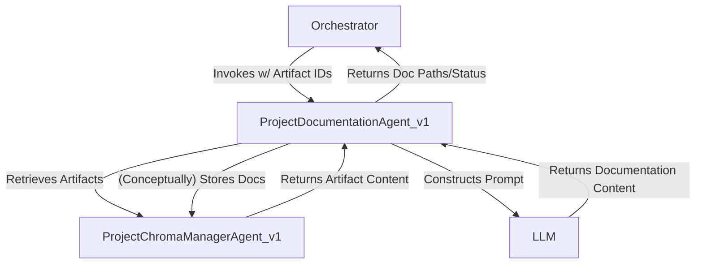

# Agent Design: ProjectDocumentationAgent_v1

## 0. Document History
| Version | Date       | Author             | Changes                                      |
|---------|------------|--------------------|----------------------------------------------|
| 0.1.0   | {TODAY_YYYY_MM_DD} | Gemini Assistant   | Initial Draft based on prompt and template. |

## 1. Purpose & Scope

### 1.1. Purpose
The `ProjectDocumentationAgent_v1` is responsible for generating comprehensive project documentation based on all available project artifacts (LOPRD, Blueprint, Master Plan, etc.), the generated codebase, and contextual information retrieved via the `ProjectChromaManagerAgent_v1` (PCMA). Its goal is to produce clear, accurate, and user-friendly documentation suitable for both end-users and developers.

### 1.2. Scope
#### 1.2.1. In Scope
*   Consuming key project artifacts (e.g., LOPRD, Blueprint, Master Plan, test summaries) via PCMA by their document IDs.
*   Conceptually scanning the generated codebase (actual scanning will be mocked in MVP, but the prompt directs the LLM to assume this capability).
*   Generating a `README.md` file for the project.
*   Generating API documentation (e.g., in `docs/api/`, structure to be defined by LLM based on prompt).
*   Generating a `codebase_dependency_audit.md`.
*   Optionally generating `RELEASE_NOTES.md`.
*   Interacting with PCMA to retrieve inputs and (conceptually) store generated documentation artifacts.
*   Adhering to the input and output schemas defined in `chungoid-core/server_prompts/autonomous_project_engine/ProjectDocumentationAgent.yaml`.

#### 1.2.2. Out of Scope
*   Directly executing documentation generation tools (e.g., Sphinx, Javadoc) in the MVP. The LLM will generate the markdown content directly.
*   Deep analysis of code beyond what an LLM can infer from file listings or high-level structure (in MVP).
*   Performing code quality checks or linting (handled by other agents or processes).
*   Publishing documentation to external sites.

## 2. High-Level Architecture


*The `ProjectDocumentationAgent_v1` is invoked by the orchestrator with IDs of key project artifacts. It uses `ProjectChromaManagerAgent_v1` to fetch these. It then prompts an LLM to generate various documentation files. The generated documents are conceptually stored back via PCMA, and paths/status are returned.*

## 3. Agent Responsibilities & Capabilities

### 3.1. Core Responsibilities
*   Aggregate and synthesize information from diverse project sources.
*   Generate human-readable and structured documentation.
*   Organize documentation into a standard project layout (e.g., `README.md`, `docs/` directory).

### 3.2. Key Capabilities (as per prompt)
*   **Context Aggregation:** Synthesize information from LOPRD, Blueprint, Master Plan, codebase (conceptual), and ChromaDB context.
*   **README Generation:** Create/update `README.md` with project overview, setup, usage.
*   **API Documentation:** Generate documentation for public APIs (structure determined by LLM).
*   **Dependency Audit:** Produce `codebase_dependency_audit.md`.
*   **Directory Structure:** Adhere to conventions for `docs/` directory.
*   **File Naming:** Use standard names like `README.md`, `RELEASE_NOTES.md`.

## 4. Input/Output Schemas

The input and output schemas are defined in `chungoid-core/server_prompts/autonomous_project_engine/ProjectDocumentationAgent.yaml`.

**Input Schema (summary):**
*   `task_id`: string
*   `project_id`: string (added for consistency)
*   `refined_user_goal_doc_id`: string (or path)
*   `project_blueprint_doc_id`: string (or path)
*   `master_execution_plan_doc_id`: string (or path)
*   `generated_code_root_path`: string (path to codebase for conceptual scanning)
*   `test_summary_doc_id`: string (optional, path to test summary)

**Output Schema (summary):**
*   `readme_doc_id`: string (ID of the stored README.md)
*   `docs_directory_doc_id`: string (ID representing the stored docs directory bundle or manifest)
*   `codebase_dependency_audit_doc_id`: string (ID of the stored audit file)
*   `release_notes_doc_id`: string (optional, ID of stored release notes)
*   `agent_confidence_score`: float

## 5. Interface Definition (Python Class & Methods - Conceptual)

```python
from pydantic import BaseModel, Field
from typing import Optional, Dict, Any

# Input Schema (matches prompt, slightly adapted for agent use)
class ProjectDocumentationAgentInput(BaseModel):
    task_id: str
    project_id: str
    refined_user_goal_doc_id: str
    project_blueprint_doc_id: str
    master_execution_plan_doc_id: str
    generated_code_root_path: str # Path for LLM to conceptually scan
    test_summary_doc_id: Optional[str] = None
    # For ARCA feedback loop if any:
    # arca_feedback_doc_id: Optional[str] = None 

# Output Schema (matches prompt)
class ProjectDocumentationAgentOutput(BaseModel):
    readme_doc_id: str
    docs_directory_doc_id: str # Represents a collection or manifest of docs files
    codebase_dependency_audit_doc_id: str
    release_notes_doc_id: Optional[str] = None
    agent_confidence_score: float = Field(..., ge=0.0, le=1.0)

class IProjectDocumentationAgent_v1:
    async def invoke_async(
        self, 
        input_data: ProjectDocumentationAgentInput, 
        full_context: Optional[Dict[str, Any]] = None
    ) -> ProjectDocumentationAgentOutput:
        raise NotImplementedError

    @staticmethod
    def get_agent_card_static() -> "AgentCard": # Forward ref for AgentCard
        raise NotImplementedError
```

## 6. Key Algorithms & Logic Flows

1.  **Initialization:** Agent is initialized (dependencies like PCMA, LLMProvider, PromptManager are injected or retrieved from `full_context`).
2.  **Input Processing:** Receives `ProjectDocumentationAgentInput`.
3.  **Context Retrieval (MVP: Mocked):**
    *   Conceptually, use PCMA to retrieve content for `refined_user_goal_doc_id`, `project_blueprint_doc_id`, `master_execution_plan_doc_id`, `test_summary_doc_id`.
    *   In MVP, these will be placeholder strings or references passed to the prompt.
4.  **Prompt Rendering:**
    *   Load the prompt from `chungoid-core/server_prompts/autonomous_project_engine/ProjectDocumentationAgent.yaml`.
    *   Render the prompt with input paths/IDs and the (conceptual) path to the codebase.
5.  **LLM Invocation:** Call the LLM with the rendered prompt.
6.  **Output Parsing (MVP: Simplified):**
    *   The LLM is expected to generate multiple documentation artifacts (README, API docs, etc.) as structured text (e.g., Markdown within a JSON structure or separate fields if the prompt is designed that way).
    *   MVP will assume the LLM returns a structure that can be mapped to the output schema, perhaps with all docs bundled into one main string or separate strings for README, etc.
7.  **Artifact Storage (MVP: Mocked):**
    *   Conceptually, store each generated document (README, individual API files, audit report) via PCMA, receiving back document IDs.
    *   In MVP, generate placeholder doc IDs (e.g., `"mock_readme_id_123"`).
8.  **Confidence Score:** Assign a heuristic confidence score (e.g., 0.75 for MVP).
9.  **Return Output:** Populate and return `ProjectDocumentationAgentOutput`.

## 7. Prompting Strategy & Templates

The primary prompt is defined in `chungoid-core/server_prompts/autonomous_project_engine/ProjectDocumentationAgent.yaml`. 
Key aspects:
*   **Role:** "You are the Project Documentation Agent..."
*   **Core Responsibilities:** Aggregating context, generating specific docs (README, API, etc.).
*   **Input Guidance:** Instructs LLM on what inputs it conceptually has access to (LOPRD, Blueprint, codebase scan, ChromaDB queries).
*   **Output Artifacts:** Clearly lists expected files.
*   **Success Factors:** Accuracy, completeness, clarity, consistency.

## 8. Interaction with `ProjectChromaManagerAgent_v1` (PCMA)

*   **Input:** PCMA will be used to retrieve the content of artifacts specified by `*_doc_id` fields in the input.
*   **Output:** Generated documentation artifacts (README.md, files in `docs/`, `codebase_dependency_audit.md`) will be stored via PCMA, and their resulting `doc_id`s will be part of the agent's output.
*   (MVP: Direct PCMA calls for content retrieval and storage will be mocked. The agent will operate on placeholder IDs and generate placeholder output IDs).

## 9. Confidence Score Generation & Interpretation

*   **Generation:** For MVP, a fixed confidence score (e.g., 0.75) will be returned. Future versions could derive this from LLM's self-assessment, or by checking if all requested documents were plausibly generated.
*   **Interpretation:** ARCA or a human reviewer would use this score to gauge the reliability of the generated documentation.

## 10. Error Handling, Resilience, and Retry Mechanisms

*   **Input Validation:** Pydantic models will validate inputs.
*   **LLM Errors:** Standard error handling for LLM calls (e.g., API errors, timeouts) should be implemented, potentially returning a low confidence score or raising an exception.
*   **PCMA Errors (MVP: N/A directly):** In a full implementation, errors from PCMA during artifact retrieval/storage would need to be handled.
*   For MVP, focus is on successful path with mocked interactions.

## 11. Dependencies
*   `LLMProvider`
*   `PromptManager`
*   `ProjectChromaManagerAgent_v1` (interface/mock for MVP)
*   Pydantic

## 12. Testing Considerations
*   Unit tests for prompt rendering.
*   Unit tests for input/output schema validation.
*   Mocked LLM responses to test output parsing.
*   Integration test (once PCMA is less mocked) to verify artifact retrieval and storage flow.

---
Note: Replace `{TODAY_YYYY_MM_DD}` with the actual date. 