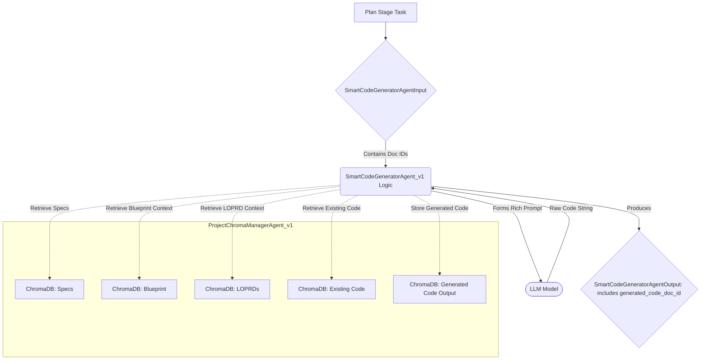

# Agent Design: SmartCodeGeneratorAgent_v1

(Enhancements for `CoreCodeGeneratorAgent_v1`)

## 0. Document History
| Version | Date       | Author             | Changes                                                                    |
|---------|------------|--------------------|----------------------------------------------------------------------------|
| 0.2.0   | YYYY-MM-DD | Gemini Assistant   | Initial Draft for "Smart" enhancements to CoreCodeGeneratorAgent_v1. Focus on ChromaDB integration for context and output. |

## 1. Purpose & Scope

### 1.1. Purpose
The `SmartCodeGeneratorAgent_v1` enhances the existing `CoreCodeGeneratorAgent_v1` by deeply integrating with `ProjectChromaManagerAgent_v1` (PCMA). Its purpose is to generate or modify source code with a richer understanding of the project context, derived from LOPRDs, Blueprints, existing codebase snapshots, and detailed specifications stored in ChromaDB. It aims to produce more accurate, contextually-aware code and to manage code artifacts via PCMA.

This agent still primarily outputs code as a string, but the management of this string (especially storage and retrieval of context) is now PCMA-driven.

### 1.2. Scope
#### 1.2.1. In Scope (Enhancements)
*   Modifying `CodeGeneratorAgentInput` (or creating a new `SmartCodeGeneratorAgentInput`) to accept ChromaDB document IDs for various contextual inputs:
    *   `project_id` (for PCMA interactions).
    *   `code_specification_doc_id`: Detailed task specification, potentially from a Master Execution Plan stage.
    *   `target_file_path`: Intended relative path of the file.
    *   `existing_code_doc_id`: Optional, ChromaDB ID for the current content of `target_file_path` if modifying.
    *   `blueprint_context_doc_id`: Optional, ChromaDB ID for relevant section(s) of the Project Blueprint.
    *   `loprd_requirements_doc_ids`: Optional, list of ChromaDB IDs for relevant LOPRD requirements.
    *   `programming_language`.
*   Interacting with `ProjectChromaManagerAgent_v1` to retrieve the content of these documents.
*   Constructing a highly contextualized prompt for the LLM using the retrieved information.
*   Invoking an LLM to generate/modify the code string.
*   Storing the generated code string as an artifact in ChromaDB (e.g., in `live_codebase_collection` or a dedicated `generated_code_snippets` collection) via `ProjectChromaManagerAgent_v1`.
*   Modifying `CodeGeneratorAgentOutput` (or creating `SmartCodeGeneratorAgentOutput`) to include:
    *   `generated_code_artifact_doc_id`: The ChromaDB ID of the stored generated code.
    *   `generated_code_string`: The actual code string (optional if very large, primary is the doc_id).
    *   `confidence_score`: A more robust confidence score reflecting contextual adherence.
*   Adhering to the principle that the agent *generates code as a string*; direct file system writes are handled by other agents (e.g., `FileOperationAgent_v1` or `SmartCodeIntegratorAgent`).

#### 1.2.2. Out of Scope
*   Directly writing to the file system.
*   Replacing the `CoreCodeGeneratorAgent_v1`'s AGENT_ID if these are considered direct evolutions of its capabilities.
*   Complex code integration logic (deferred to `SmartCodeIntegratorAgent`).

## 2. High-Level Architecture (Focus on Enhancements)


*The SmartCodeGeneratorAgent retrieves various contextual documents from ChromaDB via PCMA, uses them to form a rich prompt for an LLM, generates code, stores the generated code back into ChromaDB via PCMA, and outputs the ChromaDB document ID of the generated code.* 

## 3. Agent Responsibilities & Capabilities (Focus on Enhancements)

### 3.1. Core Responsibilities
*   Generate high-quality, contextually relevant code based on detailed specifications and rich project context retrieved from ChromaDB.
*   Manage code artifacts (input context, output code) through `ProjectChromaManagerAgent_v1`.

### 3.2. Key Capabilities
*   **Contextual Document Retrieval:** Fetch specifications, blueprint excerpts, LOPRD requirements, and existing code from ChromaDB using provided document IDs.
*   **Dynamic Prompt Construction:** Build sophisticated prompts that effectively leverage all retrieved contextual information.
*   **Artifact Management via PCMA:** Store generated code in a designated ChromaDB collection (e.g., `live_codebase_collection` or `generated_code_pending_integration`) and return its document ID.

## 4. Input/Output Schemas (Proposed Enhancements/New Schemas)

These schemas might replace or extend those in `chungoid.schemas.agent_code_generator`.

### 4.1. Input Schema: `SmartCodeGeneratorAgentInput`
```python
from pydantic import BaseModel, Field
from typing import Optional, List, Dict, Any

class SmartCodeGeneratorAgentInput(BaseModel):
    task_id: str = Field(default_factory=lambda: str(uuid.uuid4()), description="Unique ID for this code generation task.")
    project_id: str = Field(..., description="Project ID for ProjectChromaManagerAgent interactions.")
    
    code_specification_doc_id: str = Field(..., description="ChromaDB ID of the detailed code specification document (e.g., from a plan stage). Content expected to be Markdown or structured text.")
    target_file_path: str = Field(..., description="Intended relative path of the file to be created or modified.")
    programming_language: str = Field("python", description="Target programming language.")

    existing_code_doc_id: Optional[str] = Field(None, description="ChromaDB ID of the current content of target_file_path if modifying. From live_codebase_collection.")
    blueprint_context_doc_id: Optional[str] = Field(None, description="ChromaDB ID of relevant Project Blueprint section(s). From planning_artifacts collection.")
    loprd_requirements_doc_ids: Optional[List[str]] = Field(None, description="List of ChromaDB IDs for relevant LOPRD requirements. From planning_artifacts collection.")
    
    # For passing general configurations, e.g., specific LLM model preferences for this task
    agent_config: Optional[Dict[str, Any]] = Field(default_factory=dict)
    # Could include specific style guides, library version preferences if not in specs
    additional_instructions: Optional[str] = Field(None, description="Additional free-text instructions or constraints.")
```

### 4.2. Output Schema: `SmartCodeGeneratorAgentOutput`
```python
from chungoid.schemas.common import ConfidenceScore # Assuming common schema

class SmartCodeGeneratorAgentOutput(BaseModel):
    task_id: str = Field(..., description="Echoed task_id from input.")
    target_file_path: str = Field(..., description="The intended relative path (mirrors input).")
    status: Literal["SUCCESS", "FAILURE_LLM_GENERATION", "FAILURE_CONTEXT_RETRIEVAL", "FAILURE_OUTPUT_STORAGE"] = Field(..., description="Status of the code generation attempt.")
    
    generated_code_artifact_doc_id: Optional[str] = Field(None, description="ChromaDB ID of the stored generated code string (e.g., in live_codebase_collection or generated_code_pending_integration collection).")
    generated_code_string: Optional[str] = Field(None, description="The generated code string (can be omitted if very large and doc_id is provided).")
    
    confidence_score: Optional[ConfidenceScore] = Field(None, description="Agent's confidence in the generated code's correctness and contextual adherence.")
    llm_full_response: Optional[str] = Field(None, description="Raw LLM response for debugging, if applicable.")
    usage_metadata: Optional[Dict[str, Any]] = Field(None, description="LLM token usage, etc.")
    error_message: Optional[str] = Field(None, description="Error message if generation failed.")
```

## 5. API Contracts
*   The `SmartCodeGeneratorAgent_v1` is an orchestrated agent within the Autonomous Project Engine.
*   It is a heavy consumer of `ProjectChromaManagerAgent_v1` for retrieving contextual artifacts and storing its output (the generated code).

## 6. Key Algorithms & Logic Flows

1.  Receive `SmartCodeGeneratorAgentInput`.
2.  **Context Retrieval (via PCMA):**
    *   Fetch content for `code_specification_doc_id`.
    *   If `existing_code_doc_id` is provided, fetch existing code content.
    *   If `blueprint_context_doc_id` is provided, fetch blueprint context.
    *   If `loprd_requirements_doc_ids` are provided, fetch LOPRD items content.
    *   Handle errors if critical context documents are not found.
3.  **Dynamic Prompt Construction:**
    *   Assemble a comprehensive prompt for the LLM, incorporating the task description from specs, programming language, target file path, and all retrieved contextual information (existing code, blueprint, LOPRDs). Clearly delineate each piece of context for the LLM.
4.  **LLM Interaction:**
    *   Send the rich prompt to the configured LLM.
    *   Receive the generated code string.
5.  **Output Processing & Storage (via PCMA):**
    *   Store the `generated_code_string` into a designated ChromaDB collection (e.g., `live_codebase_collection` or `generated_code_pending_integration`). The metadata should include `source_agent_id`, `target_file_path`, `programming_language`, `based_on_spec_doc_id`, `timestamp`, `project_id`.
    *   Obtain the `generated_code_artifact_doc_id` from PCMA.
6.  **Confidence Score Generation:**
    *   Develop heuristics based on LLM's self-assessment (if prompted for), code complexity, adherence to specifications (potentially a light check if possible), and whether all context was successfully retrieved and used.
7.  Return `SmartCodeGeneratorAgentOutput` including the `generated_code_artifact_doc_id`.

## 7. Prompting Strategy & Templates (Conceptual)

Prompts will be managed externally (e.g., `chungoid-core/server_prompts/autonomous_engine/smart_code_generator_agent_v1.yaml`).

*   **System Prompt:** Instructs the LLM to act as an expert, context-aware code generator. Emphasize adherence to *all* provided context (specs, existing code, blueprint, LOPRDs).
*   **User Prompt Template (Illustrative Structure):**
    ```handlebars
    ### TASK: Generate/Modify Code for {{target_file_path}} ###

    **Project ID:** {{project_id}}
    **Programming Language:** {{programming_language}}

    **1. Detailed Code Specification (from Doc ID: {{code_specification_doc_id}}):**
    ```
    {{{code_specification_content}}}
    ```

    {{#if existing_code_content}}
    **2. Existing Code in {{target_file_path}} (from Doc ID: {{existing_code_doc_id}}):**
    ```{{programming_language}}
    {{{existing_code_content}}}
    ```
    {{/if}}

    {{#if blueprint_context_content}}
    **3. Relevant Project Blueprint Context (from Doc ID: {{blueprint_context_doc_id}}):**
    ```markdown
    {{{blueprint_context_content}}}
    ```
    {{/if}}

    {{#if loprd_requirements_content_map}}
    **4. Relevant LOPRD Requirements:**
    {{#each loprd_requirements_content_map}}
    *   **Requirement (Doc ID: {{this.id}}):** {{{this.content}}}
    {{/each}}
    {{/if}}

    {{#if additional_instructions}}
    **5. Additional Instructions:**
    {{{additional_instructions}}}
    {{/if}}

    **INSTRUCTIONS:**
    Based *strictly* on all the information provided above (specification, existing code, blueprint, LOPRDs, and additional instructions), generate the complete, new, or modified code for `{{target_file_path}}`.
    - If modifying, ensure your output is the *complete* final code for the file, not just a diff.
    - Adhere to coding best practices for `{{programming_language}}`.
    - Output only the raw code content for `{{target_file_path}}`. Do not include explanations or markdown fences unless the specification explicitly asks for it within the code (e.g., in comments).
    ```

## 8. Interaction with `ProjectChromaManagerAgent_v1`

*   **Read Operations:**
    *   `planning_artifacts` collection: For `code_specification_doc_id` (if spec is a planning artifact), `blueprint_context_doc_id`, `loprd_requirements_doc_ids`.
    *   `live_codebase_collection` (or equivalent): For `existing_code_doc_id`.
*   **Write Operations:**
    *   `live_codebase_collection` (or a new `generated_code_pending_integration` collection): To store the `generated_code_string`. Metadata will be crucial (e.g., `status: 'pending_integration'`, `target_file_path`, `source_agent_id`).

## 9. Confidence Score Generation & Interpretation
*   LLM will be prompted to provide a self-assessment on contextual adherence and correctness.
*   Agent heuristics will consider: LLM confidence, successful retrieval of all context, length/complexity of generated code vs. spec.
*   Output `ConfidenceScore` will be used by ARCA to decide on refinement loops or approval.

## 10. Error Handling, Resilience, and Retry Mechanisms
*   Robust error handling for PCMA failures (document not found, storage errors).
*   LLM API errors (standard retry with backoff via `LLMProvider`).
*   If critical context is missing, fail gracefully with a low confidence score and informative error message.
*   If LLM output is malformed, attempt retry with refined prompt or error out.

## 11. Testing Strategy & Metrics
*   **Unit Tests:** Mock LLM, PCMA. Test context retrieval logic, prompt rendering with various context combinations, parsing of mocked LLM responses, confidence calculation, PCMA storage calls.
*   **Integration Tests (Example: Flask App component from P3.M3):**
    *   Provide realistic specs and context docs in ChromaDB.
    *   Verify the agent retrieves context, generates plausible code.
    *   Verify generated code is stored correctly in ChromaDB.
    *   Human evaluation of code quality and contextual adherence for sample tasks.
*   **Metrics:** Code generation success rate, LLM token usage, processing time, human assessment scores for generated code quality.

## 12. Alternatives Considered & Rationale
*   **Agent directly writing to file:** Rejected to maintain separation of concerns. Code generation is distinct from file system operations and code integration (which might involve conflict resolution, AST modifications etc., handled by `SmartCodeIntegratorAgent`).
*   **Returning full code string vs. only doc_id:** For very large generated files, returning only `doc_id` is more efficient. Output schema allows for both, with `doc_id` being primary.

## 13. Open Issues & Future Work
*   Fine-tuning confidence score heuristics.
*   Strategies for handling extremely large contextual inputs (chunking, summarization prior to LLM call).
*   Allowing the agent to ask clarifying questions (via ARCA) if specifications or context are ambiguous.
*   Defining the exact schema and lifecycle for code in `generated_code_pending_integration` vs. `live_codebase_collection`.

---
*This document outlines enhancements for CoreCodeGeneratorAgent_v1, effectively defining SmartCodeGeneratorAgent_v1.* 