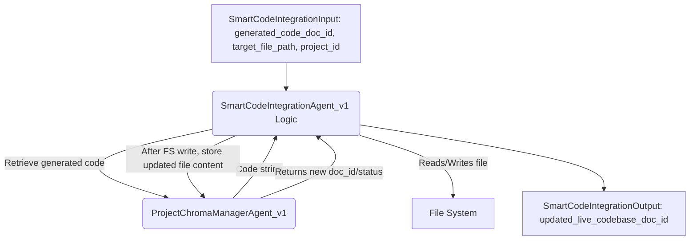

# Agent Design: SmartCodeIntegrationAgent_v1

(Enhancements for `CoreCodeIntegrationAgentV1`)

## 0. Document History
| Version | Date       | Author             | Changes                                                                      |
|---------|------------|--------------------|------------------------------------------------------------------------------|
| 0.2.0   | YYYY-MM-DD | Gemini Assistant   | Initial Draft for "Smart" enhancements. Focus on ChromaDB for code source & updating live codebase. |

## 1. Purpose & Scope

### 1.1. Purpose
The `SmartCodeIntegrationAgent_v1` enhances `CoreCodeIntegrationAgentV1` by integrating it with the `ProjectChromaManagerAgent_v1` (PCMA). Its primary purpose is to fetch generated code from a ChromaDB artifact ID (produced by `SmartCodeGeneratorAgent_v1`), integrate this code into the target file on the filesystem using existing edit actions, and then update the corresponding artifact in ChromaDB's `live_codebase_collection` to reflect the changes.

### 1.2. Scope
#### 1.2.1. In Scope (Enhancements)
*   Modifying `CodeIntegrationInput` (or creating `SmartCodeIntegrationInput`):
    *   Primary input for code to integrate becomes `generated_code_artifact_doc_id: str` (ChromaDB ID).
    *   `code_to_integrate: Optional[str]` can be kept as a fallback or for simple, direct integrations not sourced from a prior generation step.
    *   `project_id: str` for PCMA interaction.
    *   Optional: `existing_target_file_doc_id: Optional[str]` to fetch the current version of the target file from ChromaDB for more context-aware integration (especially for future, more advanced edit actions).
*   Interacting with PCMA to retrieve the code string from `generated_code_artifact_doc_id`.
*   Performing file system modifications using the existing `edit_action` logic from `CoreCodeIntegrationAgentV1` (e.g., APPEND, CREATE_OR_APPEND).
*   After successful file modification, interacting with PCMA to store/update the `target_file_path`'s new content in the `live_codebase_collection` in ChromaDB.
*   Modifying `CodeIntegrationOutput` (or creating `SmartCodeIntegrationOutput`) to include:
    *   `updated_live_codebase_doc_id: Optional[str]`: The ChromaDB ID of the updated file in `live_codebase_collection`.
    *   `md5_hash_of_integrated_file: Optional[str]`: To verify integrity.

#### 1.2.2. Out of Scope
*   Replacing the fundamental file operation logic of `CoreCodeIntegrationAgentV1` in this iteration (still uses its edit actions). More advanced AST-based or LLM-driven integration strategies are future work.
*   Directly calling an LLM for integration decisions in this version (it executes prescribed actions).

## 2. High-Level Architecture (Focus on Enhancements)


*The SmartCodeIntegrationAgent retrieves code from a ChromaDB artifact, performs file operations, and then updates the live codebase representation in ChromaDB.* 

## 3. Agent Responsibilities & Capabilities (Focus on Enhancements)

### 3.1. Core Responsibilities
*   Reliably integrate code (sourced from ChromaDB) into files on the filesystem.
*   Ensure the `live_codebase_collection` in ChromaDB accurately reflects the state of integrated files.

### 3.2. Key Capabilities
*   **Code Retrieval from ChromaDB:** Fetch code content using a document ID via PCMA.
*   **File System Integration:** Utilize existing `CoreCodeIntegrationAgentV1` edit actions.
*   **Live Codebase Update:** Store the newly modified file content back into ChromaDB's `live_codebase_collection` via PCMA, ideally versioning or replacing the existing entry for that file path.

## 4. Input/Output Schemas (Proposed Enhancements/New Schemas)

These schemas might replace or extend those in `chungoid.schemas.agent_code_integration`.

### 4.1. Input Schema: `SmartCodeIntegrationInput`
```python
from pydantic import BaseModel, Field
from typing import Optional, Literal, Dict, Any

class SmartCodeIntegrationInput(BaseModel):
    task_id: str = Field(default_factory=lambda: str(uuid.uuid4()), description="Unique ID for this integration task.")
    project_id: str = Field(..., description="Project ID for ProjectChromaManagerAgent interactions.")
    
    # Primary way to specify code to integrate
    generated_code_artifact_doc_id: Optional[str] = Field(None, description="ChromaDB ID of the artifact containing the code string to integrate (e.g., from SmartCodeGeneratorAgentOutput).")
    # Fallback or for direct small integrations
    code_to_integrate_directly: Optional[str] = Field(None, description="Direct code string to integrate. If provided and generated_code_artifact_doc_id is also present, behavior might be to prioritize one or combine, TBD.")
    
    target_file_path: str = Field(..., description="Absolute or project-relative path to the file to be modified or created.")
    edit_action: Literal["APPEND", "CREATE_OR_APPEND", "ADD_TO_CLICK_GROUP", "ADD_PYTHON_IMPORTS", "REPLACE_FILE_CONTENT"] = Field(..., description="Specifies the type of edit action.") # Added REPLACE_FILE_CONTENT
    
    # Optional: For context or more advanced integration strategies in the future
    existing_target_file_doc_id: Optional[str] = Field(None, description="ChromaDB ID of the current version of target_file_path in live_codebase_collection, for context.")
    
    # Fields from original CodeIntegrationInput (to be reused by internal logic)
    integration_point_hint: Optional[str] = Field(None, description="Hint for ADD_TO_CLICK_GROUP or future AST modifications.")
    click_command_name: Optional[str] = Field(None, description="For ADD_TO_CLICK_GROUP: name of the command function.")
    imports_to_add: Optional[str] = Field(None, description="For ADD_PYTHON_IMPORTS: newline-separated import statements.")
    backup_original: bool = Field(True, description="If true, creates a backup of the original file before modification.")
    
    agent_config: Optional[Dict[str, Any]] = Field(default_factory=dict)
```

### 4.2. Output Schema: `SmartCodeIntegrationOutput`
```python
from chungoid.schemas.common import ConfidenceScore # Assuming common schema

class SmartCodeIntegrationOutput(BaseModel):
    task_id: str = Field(..., description="Echoed task_id from input.")
    status: Literal["SUCCESS", "FAILURE", "FAILURE_CHROMA_RETRIEVAL", "FAILURE_CHROMA_UPDATE"] = Field(..., description="Status of the integration operation.")
    message: str = Field(..., description="A message detailing the outcome.")
    modified_file_path: Optional[str] = Field(None, description="Path to the file that was modified or created.")
    backup_file_path: Optional[str] = Field(None, description="Path to the backup file if one was made.")
    
    # New field for tracking the update in ChromaDB
    updated_live_codebase_doc_id: Optional[str] = Field(None, description="ChromaDB ID of the updated/newly_created file artifact in live_codebase_collection.")
    md5_hash_of_integrated_file: Optional[str] = Field(None, description="MD5 hash of the file content after integration, for verification.")
    
    confidence_score: Optional[ConfidenceScore] = Field(None, description="Agent's confidence in the successful and correct integration.") # If integration becomes LLM-driven
    error_message: Optional[str] = Field(None)
```

## 5. API Contracts
*   `SmartCodeIntegrationAgent_v1` is orchestrated.
*   Consumes services from `ProjectChromaManagerAgent_v1` to:
    *   Retrieve code from `generated_code_artifact_doc_id`.
    *   Retrieve content of `existing_target_file_doc_id` (future use).
    *   Store the new content of `target_file_path` into `live_codebase_collection`.

## 6. Key Algorithms & Logic Flows

1.  Receive `SmartCodeIntegrationInput`.
2.  **Initialize PCMA** for `project_id`.
3.  **Determine Code to Integrate:**
    *   If `generated_code_artifact_doc_id` is provided, retrieve its content (string) via PCMA. This is the primary source.
    *   Else if `code_to_integrate_directly` is provided, use that.
    *   If neither, or retrieval fails for `generated_code_artifact_doc_id`, report error.
4.  **Perform File System Integration:**
    *   Execute the specified `edit_action` on `target_file_path` using the retrieved/provided code string. This reuses the core logic from `CoreCodeIntegrationAgentV1` (handling backups, directory creation, etc.).
    *   If file operation fails, return `FAILURE` status.
5.  **Update `live_codebase_collection` (via PCMA):**
    *   If file operation was successful, read the new content of `target_file_path` from the file system.
    *   Generate an MD5 hash of this new content.
    *   Call PCMA to store this new content into `live_codebase_collection`. The document ID for this artifact could be the `target_file_path` itself (normalized) or a UUID. Metadata should include `file_path`, `project_id`, `last_modified_by_agent: SmartCodeIntegrationAgent_v1`, `timestamp`, `md5_hash`.
    *   PCMA needs to handle overwriting/versioning if an artifact for this `target_file_path` already exists.
    *   If PCMA update fails, return `FAILURE_CHROMA_UPDATE` (but file system change was made).
6.  Return `SmartCodeIntegrationOutput` with status, `updated_live_codebase_doc_id`, and `md5_hash_of_integrated_file`.

## 7. Prompting Strategy & Templates
*   This agent, in its V1 "Smart" enhancement, is **not primarily LLM-driven** for its integration logic. It executes prescribed `edit_action`s.
*   Future versions might use an LLM for more complex integrations (e.g., AST modifications, semantic diffs), which would then require prompts.

## 8. Interaction with `ProjectChromaManagerAgent_v1`

*   **Read Operations:**
    *   From `generated_code_pending_integration` or `live_codebase_collection` (or wherever `SmartCodeGeneratorAgent` stores its output): To get content of `generated_code_artifact_doc_id`.
    *   Potentially from `live_codebase_collection`: To get content of `existing_target_file_doc_id` (future).
*   **Write/Update Operations:**
    *   To `live_codebase_collection`: Store the new, full content of `target_file_path` after successful file system integration. This might be an `upsert` operation based on `target_file_path` as a key or part of metadata.
        *   PCMA will need a method like `store_file_content_as_artifact(collection_name, file_path_on_disk, metadata_for_chroma, chroma_doc_id_to_use_or_generate)`.

## 9. Confidence Score Generation & Interpretation
*   For V1, confidence is high if all steps (PCMA retrieval, file op, PCMA update) succeed.
*   Lowered if PCMA update fails but file op succeeded.
*   Future LLM-driven integration would have more nuanced confidence.

## 10. Error Handling, Resilience, and Retry Mechanisms
*   Errors during PCMA retrieval of `generated_code_artifact_doc_id` are critical failures.
*   Errors during file operations are handled by existing `CoreCodeIntegrationAgentV1` logic.
*   Errors during PCMA update of `live_codebase_collection` are reported, but the file system change might persist (potential inconsistency to manage or log for later reconciliation).

## 11. Testing Strategy & Metrics
*   **Unit Tests:** Mock PCMA. Test logic for fetching code, calling internal file operations, and calling PCMA to update live codebase.
*   **Integration Tests (Example: Part of Flask App MVP flow):**
    *   Ensure `SmartCodeGeneratorAgent` produces a code artifact in ChromaDB.
    *   Invoke `SmartCodeIntegrationAgent` to fetch this artifact and integrate it into a target file.
    *   Verify file system content is correct.
    *   Verify `live_codebase_collection` in ChromaDB is updated correctly with the new file content and metadata (including hash).
*   **Metrics:** Success rate of integration, consistency between file system and `live_codebase_collection` after operation.

## 12. `ProjectChromaManagerAgent_v1` Considerations
*   PCMA's `store_artifact` currently takes `artifact_content` as a string or dict. For updating `live_codebase_collection`, it would be beneficial if PCMA could also accept a file path and read the content itself, or if this agent reads the file and passes content to PCMA.
*   PCMA needs a clear strategy for how `live_codebase_collection` artifacts are identified and updated (e.g., using `target_file_path` as a unique ID or key metadata for upsert).

## 13. Open Issues & Future Work
*   Define robust strategy for `live_codebase_collection` updates (upsert vs. versioning) in PCMA.
*   Implement more sophisticated `edit_action`s, potentially LLM-driven or AST-based.
*   Conflict resolution if `target_file_path` was modified by another process between PCMA fetch (for context) and SCIA write.

---
*This document outlines enhancements for CoreCodeIntegrationAgentV1, effectively defining SmartCodeIntegrationAgent_v1.* 