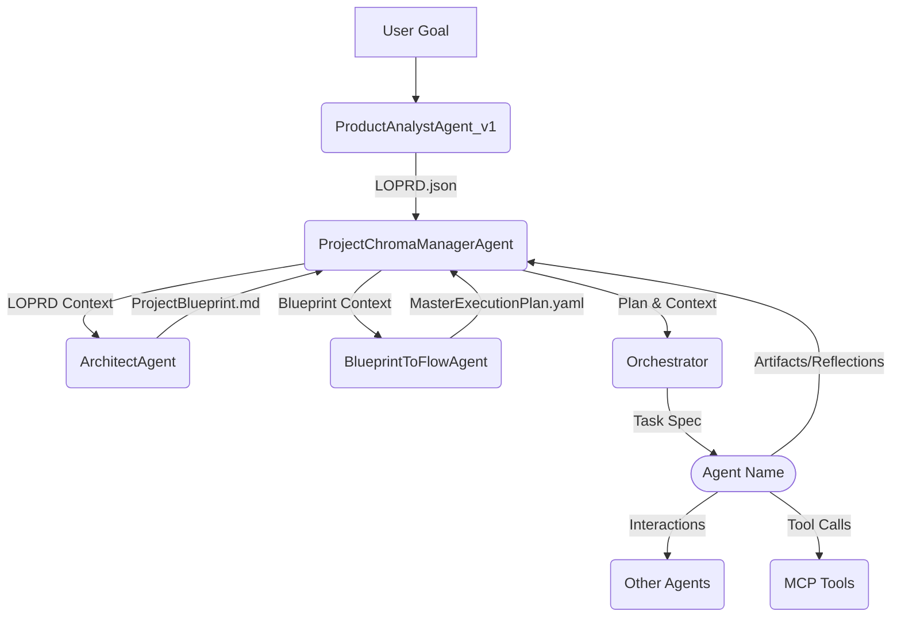
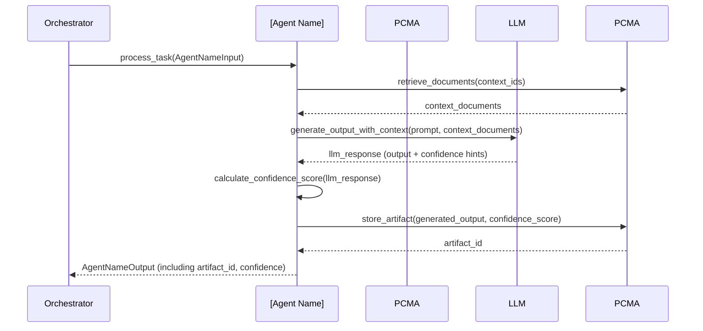

# Agent Design: [Agent Name]

## 0. Document History
| Version | Date       | Author          | Changes                                      |
|---------|------------|-----------------|----------------------------------------------|
| 0.1.0   | YYYY-MM-DD | [Author Name]   | Initial Draft                                |
|         |            |                 |                                              |

## 1. Purpose & Scope

### 1.1. Purpose
*Clearly define the primary objective of this agent. What problem does it solve? What value does it provide within the Autonomous Project Engine?*

### 1.2. Scope
#### 1.2.1. In Scope
*List the specific functionalities and responsibilities that this agent WILL handle.*

#### 1.2.2. Out of Scope
*List functionalities and responsibilities that are explicitly NOT handled by this agent, or are handled by other agents/systems.*

## 2. High-Level Architecture

*Provide a diagram (e.g., using MermaidJS or a linked image) and/or a textual description illustrating how this agent fits within the broader Autonomous Project Engine. Show key interactions with other major components (e.g., other agents, `ProjectChromaManagerAgent`, LOPRD, Orchestrator).*


*(Replace the above Mermaid diagram with one relevant to the specific agent being designed)*

## 3. Agent Responsibilities & Capabilities

### 3.1. Core Responsibilities
*Detail the primary tasks and duties the agent is responsible for performing.*

### 3.2. Key Capabilities
*List the specific skills, functions, or actions the agent can perform. E.g., "Generate Python code based on a specification," "Analyze LOPRD for ambiguities," "Query ChromaDB for similar code patterns."*

## 4. Input/Output Schemas

*Define all data structures for inputs the agent consumes and outputs it produces using Pydantic models. Include examples.*

### 4.1. Input Schema(s)
*For each primary input or message type the agent handles:*
```python
from pydantic import BaseModel, Field
from typing import Optional, List, Dict, Any

class AgentNameInput(BaseModel):
    task_id: str = Field(..., description="Unique identifier for the task.")
    context_ids: List[str] = Field(..., description="List of ChromaDB document IDs providing context (e.g., LOPRD sections, Blueprint sections).")
    # ... other relevant input fields ...
    config_options: Optional[Dict[str, Any]] = Field(default_factory=dict, description="Agent-specific configuration options.")

    class Config:
        extra = 'forbid'
```
*Example:*
```json
{
  "task_id": "task_123",
  "context_ids": ["loprd_us_001", "blueprint_module_A"],
  "config_options": {"model_preference": "gpt-4"}
}
```

### 4.2. Output Schema(s)
*For each primary output or message type the agent produces:*
```python
class AgentNameOutput(BaseModel):
    task_id: str = Field(..., description="Unique identifier for the task, echoing the input.")
    status: str = Field(..., description="Status of the processing (e.g., 'SUCCESS', 'FAILURE', 'PARTIAL_SUCCESS').")
    generated_artifact_ids: Optional[List[str]] = Field(None, description="List of ChromaDB document IDs for newly created/modified artifacts.")
    confidence_score: Optional[float] = Field(None, description="Confidence score (0.0-1.0) for the primary output.")
    # ... other relevant output fields ...
    error_details: Optional[Dict[str, Any]] = Field(None, description="Details if status is 'FAILURE'.")


    class Config:
        extra = 'forbid'
```
*Example:*
```json
{
  "task_id": "task_123",
  "status": "SUCCESS",
  "generated_artifact_ids": ["new_code_module_X.py_embedding_id"],
  "confidence_score": 0.85
}
```

## 5. API Contracts

*(If this agent exposes any functionalities as an MCP tool, or if it consumes specific MCP tools with well-defined contracts, detail them here. For internal agents primarily orchestrated, this might be less about MCP and more about defined Python interfaces if called directly by an orchestrator outside of a generic agent invocation mechanism.)*

### 5.1. Provided MCP Tools (If Any)
*Tool Name: `[agent_name_tool_xyz]`*
*   **Description:**
*   **Input Schema (JSON Schema or Pydantic model reference):**
*   **Output Schema (JSON Schema or Pydantic model reference):**
*   **Example Call:**

### 5.2. Consumed MCP Tools (If Any)
*List key MCP tools this agent relies on, and a brief note on how they are used.*
*   `web_search`: *For general research.*
*   `mcp_ontext7_get-library-docs`: *For fetching library documentation.*

### 5.3. Python Interface (If applicable for direct orchestration)
```python
class IAgentName:
    async def process_task(self, input_data: AgentNameInput) -> AgentNameOutput:
        """
        Main method to process a task.
        """
        raise NotImplementedError
```

## 6. Key Algorithms & Logic Flows

*Describe the core logic and decision-making processes of the agent. Use pseudo-code, flowcharts (MermaidJS), or sequence diagrams where appropriate to clarify complex interactions.*

### 6.1. Main Processing Loop (Example)
1.  Receive `AgentNameInput`.
2.  Validate input.
3.  Retrieve contextual documents from `ProjectChromaManagerAgent` using `context_ids`.
4.  **[Core Logic Step 1]:** Analyze context based on agent's purpose.
5.  **[Core Logic Step 2]:** Generate primary output (e.g., code, plan, review document).
6.  **[Core Logic Step 3]:** Generate confidence score for the output.
7.  Store generated artifacts and reflections via `ProjectChromaManagerAgent`.
8.  Return `AgentNameOutput`.

### 6.2. Sequence Diagram (Example Interaction)


## 7. Prompting Strategy & Templates

*(If this agent is LLM-based, detail its prompting strategy.)*

### 7.1. Core System Prompt
```text
[Core system prompt that defines the agent's persona, primary goal, and key operational guidelines. This should instruct the LLM on how to behave, what tools it might have, and its role in the autonomous engine, including interaction with LOPRDs, QA agents, and confidence scoring.]
```

### 7.2. Task-Specific Prompt Templates (Examples)
*Template for [Specific Task Type 1]:*
```text
Given the following context from the LOPRD (User Story: {{loprd.user_story_id}}, Functional Requirements: {{loprd.fr_ids}}) and the Project Blueprint (Section: {{blueprint.section_id}}):

Context:
---
{{retrieved_context_summary}}
---

Your task is to [specific instruction for the agent, e.g., "generate a Python function that fulfills these requirements."].

Consider the following:
- Adherence to LOPRD: [Explicit prompt on how to use LOPRD data]
- Interaction with QA Agents: [If applicable, how to prepare output for PRAA/RTA or use their feedback]
- Confidence: Verbally assess your confidence in the generated output.

Output Format:
[Specify expected output format, e.g., a JSON structure, a code block]
```

### 7.3. Prompt Versioning & Management
*Describe how prompt templates will be versioned and managed (e.g., stored in `chungoid-core/server_prompts/autonomous_engine/`, naming conventions).*

### 7.4. LOPRD Interaction Prompts
*Detail specific prompt components or strategies for how this agent:
*   Queries or consumes sections of the `llm_optimized_prd.json` (e.g., User Stories, FRs, ACs, NFRs) from ChromaDB.
*   Ensures its outputs are traceable to or aligned with the LOPRD.*

### 7.5. Prompt Evaluation & Refinement Plan
*Outline how the effectiveness of prompts will be evaluated and the process for refining them.*

## 8. Interaction with `ProjectChromaManagerAgent`

### 8.1. Data Read from ChromaDB
*List the types of data this agent reads from ChromaDB via `ProjectChromaManagerAgent` and for what purpose.*
*   **Collection:** `project_planning_artifacts`
    *   **Data:** `llm_optimized_prd.json` sections, `ProjectBlueprint.md` sections.
    *   **Purpose:** To gather requirements and architectural context for task execution.
*   **Collection:** `live_codebase_collection`
    *   **Data:** Embeddings of existing project code files.
    *   **Purpose:** To understand current codebase for integration or modification tasks.
*   **Collection:** `risk_assessment_reports`, `traceability_reports`, `optimization_suggestion_reports`
    *   **Data:** Reports from PRAA, RTA, and other optimization suggestions.
    *   **Purpose:** To incorporate QA feedback and improvement suggestions.

### 8.2. Data Written to ChromaDB
*List the types of data this agent writes to ChromaDB via `ProjectChromaManagerAgent`.*
*   **Collection:** `[agent_specific_artifacts_collection or project_planning_artifacts]`
    *   **Data:** Primary outputs of the agent (e.g., code files, plan documents, review summaries), along with their confidence scores.
    *   **Schema:** (Reference Output Schema in Section 4.2 or define specific artifact schema).
*   **Collection:** `agent_reflections_and_logs`
    *   **Data:** Agent's decision rationale, tool usage details, errors, debugging history, confidence score explanations.
    *   **Schema:** (Standard reflection schema, potentially extended).
*   **Collection:** `quality_assurance_logs`
    *   **Data:** If this agent participates in QA (e.g., a reviewer agent), logs of its evaluations.

## 9. Confidence Score Generation & Interpretation

### 9.1. Generation (If this agent generates artifacts)
*Describe the method by which this agent generates a confidence score for its outputs (as per Blueprint Section 2.3).*
*   *(E.g., LLM's verbalized confidence, analysis of token probabilities, perplexity-based, self-assessment against criteria, etc.)*
*   *Schema of stored confidence data (if more detailed than a single float):* `{ value: float, method: str, explanation: Optional[str], raw_scores: Optional[dict] }`

### 9.2. Interpretation (If this agent consumes artifacts with confidence scores)
*Describe how this agent uses confidence scores from other agents or artifacts.*
*   *(E.g., Prioritizing review of low-confidence items, adjusting its own processing strategy based on input confidence, etc.)*

## 10. Error Handling, Resilience, and Retry Mechanisms

*Describe potential failure modes, how the agent detects them, and its strategies for error handling, resilience, and retries.*

### 10.1. Error Detection & Reporting
*   *

### 10.2. Retry Strategies
*   *

### 10.3. Failure Escalation
*   *

### 10.4. Resilience to Input Issues
*   *

## 11. Testing Strategy & Metrics

### 11.1. Unit Tests
*   *

### 11.2. Integration Tests
*   *

### 11.3. Performance Tests (If Applicable)
*   *

### 11.4. Key Metrics for Success/Evaluation
*   *

## 12. Alternatives Considered & Rationale for Chosen Design

*Provide a brief overview of any significant alternative designs that were considered and why the current approach was chosen.*

## 13. Open Issues & Future Work

*List any known open issues, unresolved questions, or planned future enhancements related to this agent.*

---
*This is a living document.*
*Last updated: YYYY-MM-DD by [Author/Agent]* 